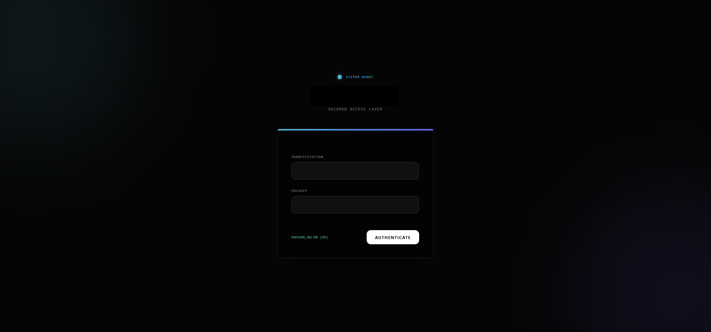
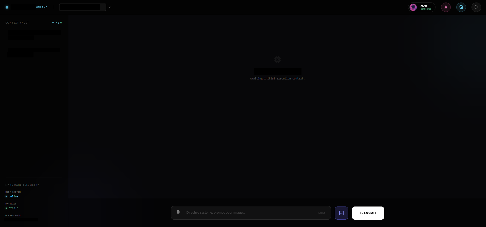
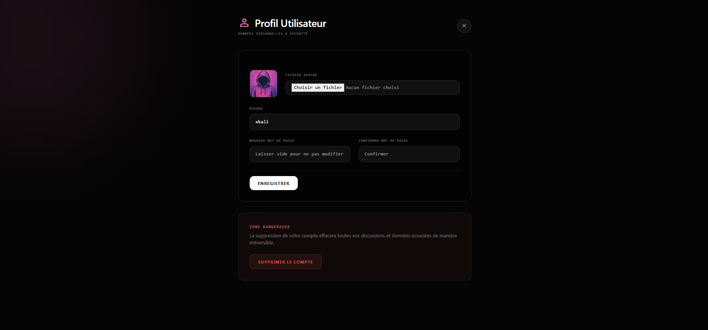
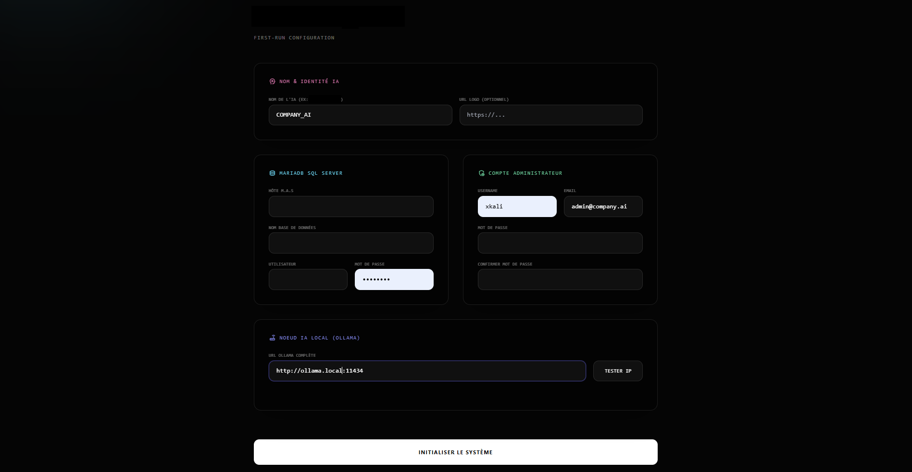

# Ollama Web Admin

A lightweight self-hosted web interface for Ollama with multi-user management, administration tools, and customizable branding.



---

## Features

### AI Chat Interface

* Chat with any Ollama model
* Clean and responsive interface
* Conversation history
* User profiles
* Local deployment
* Multiple Ollama server support



---

### User Management

* Multi-user support
* User profile management
* Password management
* Role-based administration



---

### Administration Panel

* Manage users
* Configure Ollama servers
* Change application name
* Upload custom logos
* System configuration

---

### Easy Installation

A built-in setup wizard automatically generates the configuration file and prepares the application.



---

## Requirements

* PHP 8.1 or newer
* Apache or Nginx
* Ollama
* Modern web browser

---

## Installation

### 1. Download the project

Clone the repository or download the ZIP archive.

### 2. Upload files

Place the application inside your web server directory.

Example:

```
/var/www/html/ollama-web-admin
```

### 3. Run the setup wizard

Open:

```
http://your-server/setup.php
```

Follow the installation wizard.

The setup process will:

* Create the configuration file
* Configure Ollama connection
* Create the administrator account

### 4. Login

Access the application and start chatting with your Ollama models.

---

## Screenshots

### Login


### Chat Interface


### User Profile


### Setup Wizard


---

## Security Notes

The generated `config.php` file contains local configuration values and should not be committed to Git.

---

## Customization

Administrators can:

* Change application name
* Upload custom logos
* Configure Ollama endpoints
* Manage users
* Manage permissions

---

## Contributing

Pull requests, suggestions, and improvements are welcome.

Feel free to fork the project and adapt it to your own needs.
